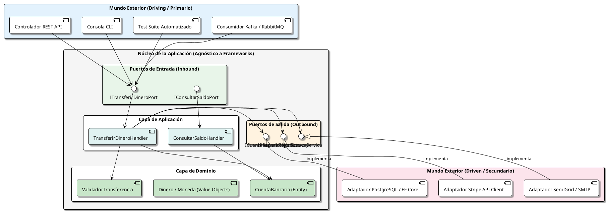

# Arquitectura Hexagonal (Puertos y Adaptadores)

## 1. Origen y Filosofía

Propuesta originalmente por **Alistair Cockburn** en 2005, la **Arquitectura Hexagonal** (conocida formalmente como el patrón de *Puertos y Adaptadores*) busca resolver uno de los mayores problemas del desarrollo de software: **el acoplamiento prematuro entre la lógica de negocio y las tecnologías externas** (bases de datos, frameworks web, colas de mensajería, servicios de terceros).

> **Objetivo fundamental:** Permitir que una aplicación sea desarrollada, probada y ejecutada de manera independiente de su entorno tecnológico final. Tu núcleo de negocio no debe saber si los datos provienen de una petición HTTP REST, un comando de terminal CLI, un test unitario automatizado o una cola de eventos RabbitMQ.



---

## 2. Los Componentes del Hexágono

La metáfora visual del "hexágono" se utiliza porque no existe una jerarquía de "arriba y abajo", sino un **interior** (el negocio) protegido y rodeado por un **exterior** (la infraestructura).

### 2.1. El Interior: Dominio y Aplicación

1. **Dominio:** Contiene las entidades, agregados, objetos de valor (*Value Objects*) y reglas que definen el negocio. No depende de ninguna librería externa (cero referencias a ORMs, paquetes de serialización JSON o utilidades de framework).
2. **Casos de Uso (Aplicación):** Orquestan el flujo de información entre el dominio y los puertos. Implementan las intenciones del usuario ("Transferir Dinero", "Registrar Usuario", "Cancelar Pedido").

### 2.2. Puertos (Ports)

Los puertos son **interfaces puras** definidas en el interior de la aplicación:

* **Puertos de Entrada (Driving / Inbound Ports):**
  - Definen la API pública que el núcleo ofrece al mundo exterior.
  - Responden a la pregunta: *¿Qué puede hacer el mundo exterior con esta aplicación?*
  - Ejemplos: `ICreateOrderUseCase`, `IRegisterUserCommand`.

* **Puertos de Salida (Driven / Outbound Ports):**
  - Definen las dependencias que el núcleo necesita que el exterior le provea.
  - Responden a la pregunta: *¿Qué necesita el núcleo para completar su trabajo?*
  - Ejemplos: `IOrderRepository`, `IPaymentGateway`, `IEmailNotifier`.

### 2.3. Adaptadores (Adapters)

Los adaptadores son la capa de traducción entre el protocolo del mundo exterior y el lenguaje del dominio:

* **Adaptadores Primarios (Driving Adapters):**
  - Convierten una petición del exterior (un JSON HTTP, un click en UI, un mensaje gRPC) en una llamada a un puerto de entrada.
  - Ejemplos: `OrderController`, `OrderCliCommand`, `OrderKafkaConsumer`.

* **Adaptadores Secundarios (Driven Adapters):**
  - Implementan los puertos de salida, traduciendo las peticiones del núcleo hacia tecnologías concretas.
  - Ejemplos: `SqlOrderRepository` (con Dapper o Hibernate), `StripePaymentAdapter`, `TwilioSmsAdapter`.

---

## 3. La Inversión de Dependencias (DIP) en Acción

El principio de inversión de dependencias es el motor que hace posible la arquitectura hexagonal:

```text
Flujo de Control (Tiempo de Ejecución):
   Controlador HTTP ──► Caso de Uso ──► Repositorio SQL

Flujo de Dependencias de Código Fuente:
   Controlador HTTP ──► Caso de Uso ──► [ Interfaz IOrderRepository ] ◄── Adaptador SQL
```

El núcleo de la aplicación define la interfaz `IOrderRepository`. El módulo de infraestructura implementa dicha interfaz. Por ende, **el código de infraestructura depende del núcleo, pero el núcleo nunca depende de la infraestructura**.

---

## 4. Estructura de Carpetas Recomendada

```text
banking-service/
│
├── src/
│   ├── Core/                                  # El interior del hexágono (agnóstico)
│   │   ├── Domain/                            # Reglas de negocio puras
│   │   │   ├── Model/
│   │   │   │   ├── Account.cs
│   │   │   │   ├── Transaction.cs
│   │   │   │   └── Money.cs (Value Object)
│   │   │   ├── Exceptions/
│   │   │   │   └── InsufficientFundsException.cs
│   │   │   └── Events/
│   │   │       └── MoneyTransferredEvent.cs
│   │   │
│   │   └── Application/                       # Casos de uso y Puertos
│   │       ├── Ports/
│   │       │   ├── Inbound/                   # Lo que el exterior puede invocar
│   │       │   │   ├── ITransferMoneyUseCase.cs
│   │       │   │   └── TransferMoneyCommand.cs
│   │       │   └── Outbound/                  # Lo que el núcleo requiere
│   │       │       ├── IAccountRepository.cs
│   │       │       ├── IAuditLogger.cs
│   │       │       └── INotificationService.cs
│   │       │
│   │       └── UseCases/                      # Implementación de los casos de uso
│   │           └── TransferMoneyHandler.cs
│   │
│   └── Adapters/                              # El exterior del hexágono
│       ├── Driving/                           # Adaptadores Primarios (Inbound)
│       │   ├── WebApi/                        # Controladores REST
│       │   │   ├── Controllers/
│       │   │   └── RequestModels/
│       │   └── Cli/                           # Comandos de consola
│       │
│       └── Driven/                            # Adaptadores Secundarios (Outbound)
│           ├── Persistence/                   # Base de datos
│           │   ├── SqlAccountRepository.cs
│           │   └── DbContext.cs
│           ├── Notifications/                 # Servicios externos
│           │   └── SendGridEmailAdapter.cs
│           └── Logging/
│               └── ElasticSearchAuditAdapter.cs
│
└── tests/
    ├── UnitTests/                             # Pruebas sin base de datos ni HTTP
    │   └── TransferMoneyUseCaseTests.cs
    └── IntegrationTests/                      # Pruebas con base de datos real (Testcontainers)
        └── SqlAccountRepositoryTests.cs
```

---

## 5. Estrategia de Pruebas: Velocidad y Confiabilidad

En la arquitectura hexagonal, las pruebas unitarias del caso de uso no necesitan levantar contenedores Docker ni configurar mocks complejos de librerías externas. Solo se implementa un adaptador en memoria:

```csharp
// Adaptador falso en memoria para pruebas ultrarrápidas
public class InMemoryAccountRepository : IAccountRepository
{
    private readonly Dictionary<Guid, Account> _store = new();

    public Task<Account?> GetByIdAsync(Guid id) =>
        Task.FromResult(_store.GetValueOrDefault(id));

    public Task SaveAsync(Account account)
    {
        _store[account.Id] = account;
        return Task.CompletedTask;
    }
}

// Prueba unitaria ejecutada en milisegundos
[Fact]
public async Task TransferMoney_WithSufficientBalance_ShouldSucceed()
{
    // Arrange
    var repo = new InMemoryAccountRepository();
    var source = new Account(Guid.NewGuid(), new Money(500, "USD"));
    var target = new Account(Guid.NewGuid(), new Money(100, "USD"));
    await repo.SaveAsync(source);
    await repo.SaveAsync(target);

    var useCase = new TransferMoneyHandler(repo, new DummyNotificationService());

    // Act
    await useCase.ExecuteAsync(new TransferMoneyCommand(source.Id, target.Id, 200));

    // Assert
    var updatedSource = await repo.GetByIdAsync(source.Id);
    Assert.Equal(300, updatedSource.Balance.Amount);
}
```

---

## 6. Comparación: Hexagonal vs Clean Architecture vs Onion

A menudo estos tres términos se usan como sinónimos porque comparten la misma regla de dependencias:

| Aspecto | Arquitectura Hexagonal (Cockburn) | Onion Architecture (Palermo) | Clean Architecture (Martin) |
| :--- | :--- | :--- | :--- |
| **Concepto Central** | Puertos y Adaptadores | Capas concéntricas (Domain Services) | Regla de la Dependencia e Interactors |
| **Visualización** | Hexágono con periferia simétrica | Círculos concéntricos como cebolla | 4 anillos concéntricos con flechas hacia el centro |
| **Énfasis** | Simetría entre entrada y salida | Dominio en el centro rodeado por servicios de aplicación | Casos de uso explícitos, UI y Frameworks en el exterior |

> **Conclusión práctica:** Todas convergen en la misma idea: **el núcleo de tu negocio es lo más valioso y debe permanecer inmune a los cambios de frameworks, bibliotecas y herramientas de infraestructura**.
