# Arquitectura Serverless y Cloud-Native

## 1. Definición y Filosofía

La **Arquitectura Serverless** es un modelo de ejecución en la nube donde el proveedor de infraestructura gestiona dinámicamente la asignación y el aprovisionamiento de servidores. El desarrollador solo escribe y despliega código (en forma de funciones o contenedores ligeros), pagando **exclusivamente por los recursos consumidos durante la ejecución exacta de las peticiones** (modelo *Pay-as-you-Go* puro, con costo $0 cuando no hay tráfico).

> **Premisa Serverless:** *"No server is easier to manage than no server"*. Elimina tareas operacionales como parcheo de sistemas operativos, escalado manual de máquinas virtuales y aprovisionamiento de capacidad en reposo.

```plantuml
@startuml
!theme plain
skinparam roundCorner 8
skinparam defaultFontName "Segoe UI", sans-serif
skinparam shadowing true
skinparam packageStyle rectangle

package "Fuentes de Eventos (Triggers)" as Triggers #E3F2FD {
  [Petición HTTPS / REST] as HTTP #FFFFFF
  [Subida de Archivo a Storage] as File #FFFFFF
  [Cron Job / Temporizador] as Schedule #FFFFFF
  queue "Mensaje en Cola SQS / PubSub" as Queue #FFE082
}

package "Plataforma Serverless (FaaS / CaaS)" as ServerlessPlatform #F5F5F5 {
  [API Gateway / Event Router] as Router #00897B;text:white

  package "Instancias Efímeras (Autoescalado 0 a N)" as Instances #E0F2F1 {
    [Función Lambda 1] as F1 #FFFFFF
    [Función Lambda 2] as F2 #FFFFFF
    [Función Lambda N] as FN #FFFFFF
  }
}

package "Servicios Gestionados de Persistencia" as Persistence #FFF3E0 {
  database "Serverless DB\n(DynamoDB / Firestore)" as NoSQL #BBDEFB
  folder "Object Storage\n(S3 / Cloud Storage)" as Blob #ECEFF1
}

HTTP -right-> Router
File -right-> Router
Schedule -right-> Router
Queue -right-> Router

Router -right-> F1
Router -right-> F2
Router -right-> FN

F1 -right-> NoSQL : Lee / Escribe
F2 -right-> Blob : Guarda archivo
@enduml
```



---

## 2. Modelos de Cómputo Serverless: FaaS vs CaaS Serverless

| Criterio | Function-as-a-Service (FaaS) | Serverless Containers (CaaS) |
| :--- | :--- | :--- |
| **Ejemplos** | AWS Lambda, Azure Functions, Google Cloud Functions | Google Cloud Run, AWS App Runner / Fargate, Azure Container Apps |
| **Unidad de Despliegue** | Archivo `.zip` de código o imagen ligera | Contenedor Docker estándar OCI |
| **Límite de Tiempo de Ejecución** | Habitualmente 5 a 15 minutos | Flexible (desde 60 min hasta sin límite según proveedor) |
| **Portabilidad** | Depende fuertemente del SDK del proveedor cloud | **100% portable** (corre idéntico en local o en cualquier nube) |
| **Control de Entorno** | Runtimes predefinidos por el proveedor | Control total del sistema operativo, binarios y librerías |

---

## 3. Retos Críticos en Serverless y Soluciones de Ingeniería

### 3.1. Cold Starts (Arranques en Frío)
Cuando una función no ha recibido tráfico reciente y entra una nueva petición, el proveedor debe aprovisionar un contenedor, descargar la imagen, iniciar el runtime e inicializar dependencias.

* **Impacto:** Puede añadir entre 200 ms y 3 segundos a la primera petición.
* **Estrategias de Mitigación:**
  - **Minimizar el tamaño del artefacto:** Eliminar librerías innecesarias.
  - **Compilación Nativa:** Usar Go, Rust o compilar .NET con Native AOT o Java con GraalVM (arranque en menos de 15 ms).
  - **Provisioned Concurrency:** Configurar instancias siempre encendidas para endpoints que demandan latencia ultrabaja garantizada.

### 3.2. Agotamiento de Conexiones a Bases de Datos (Connection Exhaustion)
En un servidor tradicional, un pool de 20 conexiones atiende miles de peticiones secuenciales. En serverless, si entran 1,000 peticiones concurrentes, el proveedor levanta 1,000 funciones efímeras; si cada una abre una conexión a PostgreSQL o MySQL, colapsarán la base de datos de inmediato.

* **Solución:**
  - Utilizar proxies de conexión gestionados con multiplexación (como **AWS RDS Proxy**, **PgBouncer**, o **Google Cloud SQL Auth Proxy**).
  - Adoptar bases de datos diseñadas nativamente para serverless con conexión HTTP (como **Amazon DynamoDB**, **Google Cloud Firestore**, **PlanetScale**, o **Neon**).

---

## 4. Estructura de Proyecto Serverless (Clean Handler Pattern)

Para evitar quedar atrapado en el vendor lock-in del proveedor cloud, los manejadores de funciones serverless deben ser únicamente "adaptadores finos":

```text
serverless-order-processing/
│
├── serverless.yml / template.yaml     # Infraestructura como Código (SAM, Serverless Framework, Terraform)
│
├── src/
│   ├── Handlers/                      # Fina capa de adaptación al proveedor cloud
│   │   ├── CreateOrderHandler.cs      # AWS Lambda entrypoint
│   │   └── ProcessPaymentQueue.cs     # SQS/EventBridge consumer entrypoint
│   │
│   ├── Core/                          # Lógica de dominio pura (100% agnóstica de AWS/Azure)
│   │   ├── Services/
│   │   │   └── OrderProcessor.cs
│   │   └── Models/
│   │       └── Order.cs
│   │
│   └── Adapters/                      # Integración con storage y bases de datos
│       ├── DynamoDbOrderRepository.cs
│       └── SnsEventPublisher.cs
│
└── tests/
    └── OrderProcessorTests.cs         # Pruebas unitarias sin mocks de AWS Lambda
```

---

## 5. Análisis Costo-Beneficio: Serverless vs Contenedores Dedicados

```text
Costo ($)
  ▲
  │                                     / Contenedor Tradicional Fijo (ECS / EKS)
  │                                    /  (Costo constante aunque no haya tráfico)
  │                         ──────────/
  │                        /         /
  │                       /         /  <-- Punto de cruce de costo
  │                      /         /
  │                     /         /
  │   Serverless       /         /
  │  (Pago por uso)  /         /
  │                 /         /
  └────────────────/─────────/────────────────► Volumen de Peticiones Continuas
```

* **Ideal para Serverless:**
  - Cargas de trabajo intermitentes o impredecibles (tiendas online con promociones puntuales, procesamiento nocturno por lotes).
  - Startups en fase de MVP donde el tráfico inicial es bajo y el costo debe ser cercano a cero.
  - Procesamiento asíncrono de eventos (redimensión de imágenes, webhooks de terceros, analítica en streaming).

* **Mejor Contenedores Tradicionales (Kubernetes / VMs):**
  - Aplicaciones con tráfico constante alto y estable 24/7 (donde pagar por cada invocación por milisegundo resulta más costoso que pagar una instancia reservada).
  - Tareas con conexiones de streaming continuo bidireccional (WebSockets masivos de larga duración).
