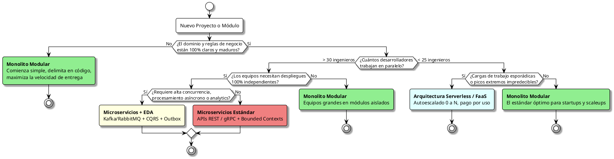
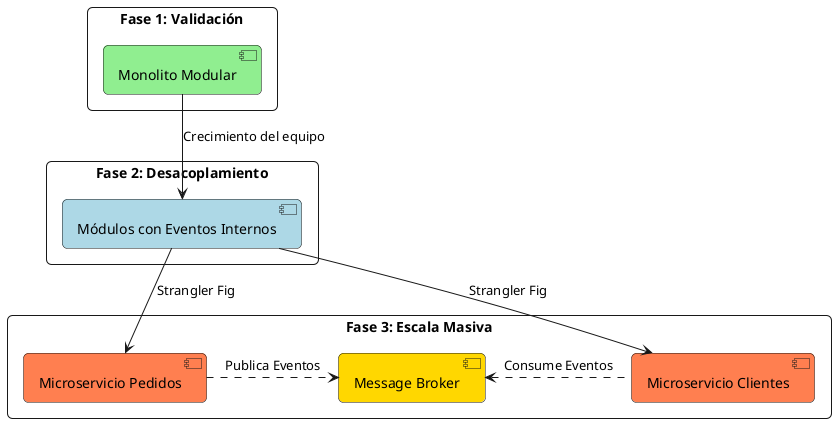

# Matriz Comparativa y Criterios de Selección

## 1. Filosofía de los Trade-offs Arquitectónicos

> *"En la arquitectura de software no existen soluciones perfectas; solo existen trade-offs (compromisos)".* — Neal Ford & Mark Richards

Elegir una arquitectura no consiste en buscar la tecnología "más moderna", sino en encontrar el equilibrio adecuado entre las capacidades de tu equipo, los requisitos no funcionales del negocio (rendimiento, escalabilidad, disponibilidad) y el presupuesto operacional disponible.

---

## 2. Matriz Comparativa Multidimensional

| Estilo Arquitectónico | Complejidad de Operación | Velocidad Inicial (Time-to-Market) | Escalabilidad de Equipos | Aislamiento de Fallos | Consistencia de Datos | Costo de Infraestructura |
| :--- | :---: | :---: | :---: | :---: | :---: | :---: |
| **Monolito Modular** | ⭐ (Muy Baja) | ⭐⭐⭐⭐⭐ (Excelente) | ⭐⭐⭐ (Bueno, hasta ~40 devs) | ⭐⭐ (Fallo en proceso) | ⭐⭐⭐⭐⭐ (ACID / Transaccional) | 💰 (Mínimo) |
| **Arquitectura Hexagonal** | ⭐ (Agnóstica) | ⭐⭐⭐⭐ (Alta disciplina) | ⭐⭐⭐ (Por servicio) | ⭐⭐⭐ (Alta testabilidad) | N/A (Patrón de código) | 💰 (Agnóstica) |
| **Microservicios** | ⭐⭐⭐⭐⭐ (Muy Alta) | ⭐⭐ (Lenta al inicio) | ⭐⭐⭐⭐⭐ (Escala a cientos de devs) | ⭐⭐⭐⭐⭐ (Aislamiento total) | ⭐⭐ (Consistencia Eventual) | 💰💰💰💰💰 (Elevado) |
| **Orientada a Eventos (EDA)**| ⭐⭐⭐⭐ (Alta) | ⭐⭐⭐ (Moderada) | ⭐⭐⭐⭐ (Muy desacoplada) | ⭐⭐⭐⭐ (Alta resiliencia) | ⭐⭐ (Consistencia Eventual) | 💰💰💰 (Moderado/Alto) |
| **Serverless (FaaS)** | ⭐⭐ (Baja en servers) | ⭐⭐⭐⭐ (Rápida en prototipos) | ⭐⭐⭐⭐ (Por función/servicio) | ⭐⭐⭐⭐ (Por ejecución) | ⭐⭐⭐ (Depende de DB) | 💰 (Paga por uso real) |
| **Microfrontends** | ⭐⭐⭐⭐ (Alta) | ⭐⭐ (Setup inicial complejo) | ⭐⭐⭐⭐⭐ (Despliegues UI autónomos)| ⭐⭐⭐ (Parcial en UI) | N/A (Capa de presentación) | 💰💰 (CDN / Storage) |

---

## 3. Árbol de Decisión para Elegir tu Arquitectura

Utiliza este diagrama de flujo como punto de partida para evaluar el estilo arquitectónico más adecuado para tu iniciativa:

---

## 4. Patrones de Evolución Natural

Los sistemas de software exitosos rara vez comienzan en la arquitectura más compleja; evolucionan orgánicamente a medida que crecen:

1. **Fase 1 (Validación / Startup):**
   - **Monolito Modular** aplicando **Arquitectura Hexagonal** en sus módulos clave.
   - Todo corre en una sola máquina virtual o contenedor Docker sencillo.
   - Base de datos única con esquemas lógicos separados.
2. **Fase 2 (Crecimiento de Equipos y Escala):**
   - Se introducen **Eventos en memoria** para desacoplar operaciones de negocio.
   - Se migran tareas lentas en segundo plano a servicios de mensajería (RabbitMQ / SQS).
3. **Fase 3 (Hiperescala y Especialización):**
   - Los módulos con requerimientos de escalado independiente o con equipos dedicados se extraen usando el **patrón Strangler Fig** hacia **Microservicios dedicados**.
   - Se implementa el **patrón Transactional Outbox** y **Event-Driven Architecture** para sincronización distribuida.
   - En el frontend, si los equipos web crecen exponencialmente, se adoptan **Microfrontends**.

---

## 5. Diagrama de Transición de Arquitectura (PlantUML / Kroki)

Este diagrama es renderizado dinámicamente mediante el plugin **Kroki** usando **PlantUML**:

