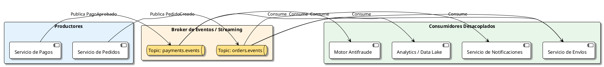
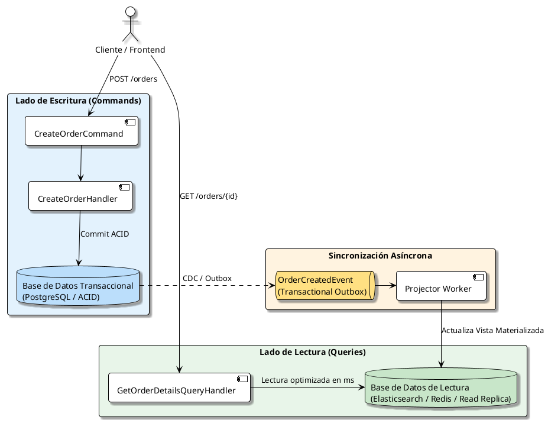

# Arquitectura Orientada a Eventos (EDA, CQRS y Sagas)

## 1. Fundamentos de Event-Driven Architecture (EDA)

La **Arquitectura Orientada a Eventos (EDA)** es un paradigma en el que los componentes de software reaccionan a la captura, procesamiento y persistencia de **eventos significativos del negocio** en lugar de comunicarse exclusivamente mediante peticiones síncronas de bloqueo (como HTTP REST o RPC).

> **Definición de Evento:** Un registro inmutable de que algo relevante ha ocurrido en el pasado dentro del dominio (ej. `PedidoPagado`, `UsuarioRegistrado`, `InventarioAgotado`). Los eventos se nombran siempre en tiempo pasado.



---

## 2. Tipos de Eventos

No todos los eventos se diseñan de la misma forma:

| Tipo de Evento | Descripción | Payload | Caso de Uso Típico |
| :--- | :--- | :--- | :--- |
| **Event Notification** | Notifica que algo ocurrió con mínima información. | Ligero (solo IDs: `{ "orderId": "123" }`) | Cuando los consumidores deben consultar al productor si necesitan detalles. Menor acoplamiento de esquema. |
| **Event-Carried State Transfer (ECST)** | Incluye el estado completo del recurso modificado. | Pesado (toda la entidad: IDs, cliente, líneas, totales) | Permite al consumidor guardar su propia copia local de los datos sin volver a llamar al productor por HTTP. |
| **Domain Event** | Ocurre dentro del agregado de dominio (DDD). | Enfocado en la regla de negocio interna | Comunicación in-process entre agregados del mismo microservicio o módulo. |

---

## 3. Patrones Arquitectónicos Clave

### 3.1. Patrón CQRS (Command Query Responsibility Segregation)

Separa explícitamente las operaciones que **modifican datos (Commands)** de las operaciones que **leen datos (Queries)**, permitiendo escalar y optimizar cada modelo de manera independiente:



---

### 3.2. Patrón Transactional Outbox

Uno de los mayores desafíos en arquitecturas distribuidas es: **¿Cómo actualizar la base de datos local y publicar un evento en el broker de forma atómica sin soporte de 2-Phase Commit (2PC)?**

Si el broker falla después de hacer commit en la base de datos, el evento se pierde. Si el commit falla después de enviar al broker, se publican eventos fantasmas.

**Solución con Transactional Outbox:**
1. En la **misma transacción de base de datos** donde guardas tu entidad, insertas un registro en una tabla auxiliar llamada `Outbox`.
2. Un proceso en segundo plano (Worker, Debezium con CDC, o Polling) lee la tabla `Outbox` y publica los mensajes en el Message Broker.
3. Una vez confirmado el envío por el broker, el mensaje se marca como procesado en la tabla `Outbox`.

```sql
-- Transacción atómica local
BEGIN TRANSACTION;

INSERT INTO Orders (Id, CustomerId, TotalAmount, Status)
VALUES ('9b1deb4d', 'cust-01', 150.00, 'Created');

INSERT INTO OutboxMessages (Id, OccurredOn, Type, Payload, ProcessedOn)
VALUES (
    gen_random_uuid(),
    NOW(),
    'OrderCreatedIntegrationEvent',
    '{"orderId": "9b1deb4d", "customerId": "cust-01", "total": 150.00}',
    NULL
);

COMMIT;
```

---

### 3.3. Transacciones Distribuidas: El Patrón Saga

Cuando un proceso de negocio involucra múltiples microservicios (por ejemplo: `Crear Pedido` -> `Cobrar Tarjeta` -> `Reservar Inventario` -> `Generar Envío`), no podemos usar una transacción ACID global. Se utiliza una **Saga**, que es una secuencia de transacciones locales coordinadas. Si un paso falla, se ejecutan **transacciones compensatorias** (deshacer en reversa).

Existen dos estilos de Saga:

#### A. Coreografía (Choreography)
- Cada servicio publica eventos y los otros servicios reaccionan directamente.
- **Ventajas:** Simple para flujos pequeños (2-3 pasos), no hay punto central de fallo.
- **Desventajas:** Difícil de rastrear y depurar cuando hay más de 5 pasos ("arquitectura de espagueti de eventos").

#### B. Orquestación (Orchestration)
- Un servicio dedicado (el **Saga Orchestrator**) le indica explícitamente a cada servicio qué comando ejecutar y gestiona la máquina de estados.
- **Ventajas:** Visibilidad centralizada del estado del flujo, manejo claro de rollbacks y timeouts.
- **Desventajas:** Dependencia adicional del orquestador.

---

## 4. Resiliencia: Idempotencia y Dead Letter Queues (DLQ)

En sistemas distribuidos, la garantía de entrega de los brokers suele ser **At-Least-Once** (al menos una vez). Esto significa que un consumidor puede recibir el mismo mensaje dos o más veces por reintentos de red.

### Idempotencia en el Consumidor
Para evitar duplicar operaciones críticas (como cobrar dos veces a una tarjeta), cada consumidor debe registrar los IDs de los mensajes procesados:

```csharp
public async Task Handle(OrderPaymentRequestedEvent message)
{
    // 1. Verificar si el mensaje ya fue procesado
    if (await _inboxRepository.ExistsAsync(message.MessageId))
    {
        _logger.LogInformation("Mensaje duplicado ignorado: {MessageId}", message.MessageId);
        return;
    }

    // 2. Ejecutar la operación de negocio
    await _paymentGateway.ChargeAsync(message.CustomerId, message.Amount);

    // 3. Registrar en la tabla Inbox para asegurar idempotencia futura
    await _inboxRepository.RecordProcessedAsync(message.MessageId);
}
```

### Dead Letter Queue (DLQ)
Cuando un mensaje no puede procesarse tras varios reintentos con **Backoff Exponencial** (por ejemplo, debido a datos corruptos o errores irrecuperables), no debe bloquear la cola. Se desvía automáticamente a una **Cola de Mensajes Muertos (DLQ)** para análisis manual y reenvío posterior (*replay*).

---

## 5. Comparativa de Message Brokers y Event Streaming

| Plataforma | Paradigma | Modelo de Consumo | Retención de Mensajes | Caso de Uso Ideal |
| :--- | :--- | :--- | :--- | :--- |
| **Apache Kafka** | Log de Eventos Distribuido (*Event Streaming*) | Pull (Consumer Groups con Offset) | Configurable (días, meses o infinito) | Telemetría, Big Data, Event Sourcing, Replay de eventos históricos |
| **RabbitMQ** | Message Broker Tradicional (AMQP) | Push/Pull (Colas inteligentes) | Los mensajes se eliminan tras ser reconocidos (*ACK*) | Enrutamiento complejo (Topics, Direct, Fanout), tareas en background, flujos RPC |
| **AWS SQS + SNS** | Cloud Managed Serverless | Polling (SQS) / Fanout (SNS) | Hasta 14 días | Arquitecturas serverless en la nube de AWS con mantenimiento cero |
| **Google Cloud Pub/Sub** | Mensajería Global Cloud-Native | Push / Pull Streaming | Hasta 7 días | Sistemas multi-región a escala masiva sin administración de clústeres |
