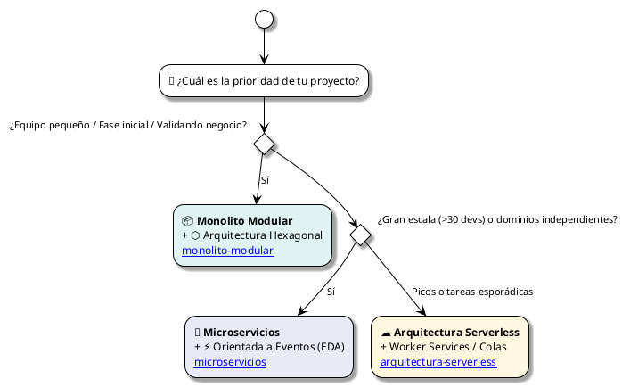

# Portal de Arquitecturas de Software

Bienvenido al centro de referencia y buenas prácticas de **Arquitectura de Software**. Esta documentación reúne guías detalladas, estructuras de directorios recomendadas, patrones de diseño y criterios de decisión para diseñar sistemas robustos, escalables y mantenibles.

---

## 🏛️ Catálogo de Arquitecturas

Explora cada una de las arquitecturas disponibles a continuación:

-   :material-server-network:{ .lg .middle } __[Arquitectura de Microservicios](microservicios.md)__

    ---

    Estructura profesional orientada a **Clean Architecture** y **Domain-Driven Design (DDD)**. Independencia de despliegue, base de datos por servicio, comunicación síncrona/asíncrona, contenedores con Docker y Kubernetes.

    [:octicons-arrow-right-24: Ver Guía de Microservicios](microservicios.md)

-   :material-package-variant-closed:{ .lg .middle } __[Monolito Modular](monolito-modular.md)__

    ---

    El estándar recomendado antes de distribuir: despliegue en un único artefacto con fronteras estrictas de módulos, eventos en memoria, esquemas de datos aislados y pruebas de arquitectura automáticas.

    [:octicons-arrow-right-24: Ver Guía de Monolito Modular](monolito-modular.md)

-   :material-hexagon-multiple:{ .lg .middle } __[Arquitectura Hexagonal](arquitectura-hexagonal.md)__

    ---

    Patrón de **Puertos y Adaptadores**. Aísla tu núcleo de negocio de bases de datos, interfaces web y proveedores externos mediante inversión de dependencias y pruebas unitarias ultrarrápidas.

    [:octicons-arrow-right-24: Ver Guía de Arquitectura Hexagonal](arquitectura-hexagonal.md)

-   :material-lightning-bolt:{ .lg .middle } __[Orientada a Eventos (EDA & CQRS)](event-driven.md)__

    ---

    Sistemas altamente desacoplados y resilientes: separación de lecturas y escrituras (**CQRS**), transacciones distribuidas con **Sagas**, garantía de entrega con **Transactional Outbox** y brokers como Kafka y RabbitMQ.

    [:octicons-arrow-right-24: Ver Guía Orientada a Eventos](event-driven.md)

-   :material-cloud-outline:{ .lg .middle } __[Arquitectura Serverless](arquitectura-serverless.md)__

    ---

    Cómputo en la nube por evento (FaaS / CaaS): escalado instantáneo a demanda, mitigación de *Cold Starts*, gestión de pools de conexión a bases de datos y optimización de costos *Pay-as-you-Go*.

    [:octicons-arrow-right-24: Ver Guía Serverless](arquitectura-serverless.md)

-   :material-view-dashboard-variant:{ .lg .middle } __[Arquitectura de Microfrontends](microfrontends.md)__

    ---

    Extiende la autonomía de los microservicios hacia la interfaz de usuario: composición en runtime con **Webpack Module Federation**, Web Components, comunicación sin acoplamiento y el patrón **BFF**.

    [:octicons-arrow-right-24: Ver Guía de Microfrontends](microfrontends.md)

-   :material-scale-balance:{ .lg .middle } __[Matriz Comparativa y Decisión](comparativa-arquitecturas.md)__

    ---

    Análisis multidimensional de trade-offs (costo, complejidad operacional, latencia, consistencia) y un **árbol de decisión interactivo** para elegir la arquitectura adecuada para tu proyecto.

    [:octicons-arrow-right-24: Ver Matriz Comparativa](comparativa-arquitecturas.md)

---

## 🧭 ¿Qué arquitectura elegir? (Guía Rápida)

---

## 📋 Resumen Comparativo de Estilos

| Arquitectura | Tipo | Mejor para | Mayor Desafío |
| :--- | :--- | :--- | :--- |
| **[Microservicios](microservicios.md)** | Distribuida | Múltiples equipos autónomos, escalado selectivo por servicio | Complejidad operacional y consistencia distribuida |
| **[Monolito Modular](monolito-modular.md)** | Centralizada | Startups, empresas medianas, alta velocidad de entrega | Disciplina para no romper límites de módulos |
| **[Arquitectura Hexagonal](arquitectura-hexagonal.md)** | Estilo Interno | Proteger la lógica de negocio contra cambios de tecnología | Curva de aprendizaje y código boilerplate inicial |
| **[Orientada a Eventos](event-driven.md)** | Distribuida / Asíncrona | Procesamiento en tiempo real, workflows asíncronos desacoplados | Trazabilidad distribuida y gestión de eventos eventuales |
| **[Serverless](arquitectura-serverless.md)** | Gestionada en Nube | Cargas esporádicas, prototipado rápido, APIs con tráfico variable | Cold starts y gestión de conexiones a bases de datos |
| **[Microfrontends](microfrontends.md)** | Presentación | Equipos grandes de frontend que se bloquean al desplegar | Consistencia visual y sobrecarga de librerías en navegador |

> [!TIP]
> Para un análisis profundo de todas las variables técnicas y organizacionales, consulta la **[Matriz Comparativa y Criterios de Selección](comparativa-arquitecturas.md)**.
