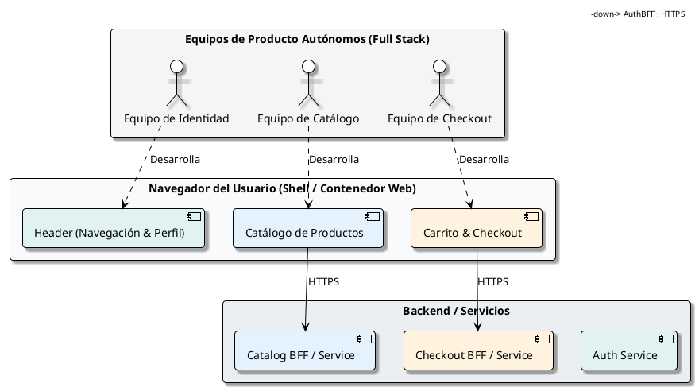
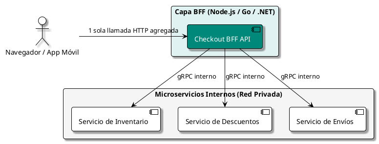

# Arquitectura de Microfrontends

## 1. Motivación y Problema Central

A medida que las organizaciones adoptan microservicios en el backend, surge una paradoja común: **el backend está descompuesto en decenas de servicios ágiles, pero todos alimentan a una única Single Page Application (SPA) monolítica masiva**.

```text
SITUACIÓN MONOLÍTICA TRADICIONAL EN EL FRONTEND:

   ┌───────────────────────────────────────────────────────────┐
   │             MONOLITO FRONTEND (Una sola SPA)              │
   │  (Un único repositorio, 40 desarrolladores, builds lentos)│
   └───────────────┬───────────────────────────┬───────────────┘
                   │                           │
                   ▼                           ▼
          ┌─────────────────┐         ┌─────────────────┐
          │ Microservicio A │         │ Microservicio B │
          └─────────────────┘         └─────────────────┘
```

El patrón de **Microfrontends** extiende los principios de los microservicios hacia la capa de interfaz de usuario: permite descomponer la aplicación web en características semi-independientes desarrolladas por equipos autónomos multidisciplinares de extremo a extremo (*Vertical Slices*).



---

## 2. Estrategias de Composición

Existen 3 enfoques principales para ensamblar microfrontends:

| Estrategia | Mecanismo | Ventajas | Desventajas |
| :--- | :--- | :--- | :--- |
| **Composición en Cliente (Runtime)** | **Module Federation** (Webpack 5 / Vite) o Web Components | Despliegues independientes sin compilar el contenedor; actualización inmediata. | Requiere gobernanza de dependencias compartidas para no inflar el bundle. |
| **Composición en Servidor (SSR)** | Edge-Side Includes (ESI) o servidores Node.js intermedios | Excelente para SEO y rendimiento inicial en primer render (*First Contentful Paint*). | Mayor complejidad de infraestructura y latencia en el servidor. |
| **Integración por Paquetes NPM (Build-time)** | Publicar cada módulo como paquete privado e instalar en el host | Tipado estricto y pruebas locales directas. | **Antipatrón para microfrontends reales**: cualquier cambio exige recompilar y desplegar toda la aplicación host. |

---

## 3. Composición en Runtime con Webpack Module Federation

**Module Federation** es el estándar de la industria para microfrontends modernos. Permite que una aplicación host descargue dinámicamente código JavaScript compilado desde otros servidores remotos en tiempo de ejecución:

```javascript
// webpack.config.js del Microfrontend "Cart" (Remoto)
const { ModuleFederationPlugin } = require("webpack").container;

module.exports = {
  plugins: [
    new ModuleFederationPlugin({
      name: "cartApp",
      filename: "remoteEntry.js",
      exposes: {
        "./CartButton": "./src/components/CartButton.tsx",
        "./CheckoutPage": "./src/pages/CheckoutPage.tsx",
      },
      shared: {
        react: { singleton: true, requiredVersion: "^18.2.0" },
        "react-dom": { singleton: true, requiredVersion: "^18.2.0" },
      },
    }),
  ],
};
```

En la aplicación contenedor (Shell / Host):

```javascript
// webpack.config.js de la Shell Application (Host)
new ModuleFederationPlugin({
  name: "shell",
  remotes: {
    cartApp: "cartApp@https://cdn.empresa.com/cart/remoteEntry.js",
    catalogApp: "catalogApp@https://cdn.empresa.com/catalog/remoteEntry.js",
  },
  shared: {
    react: { singleton: true },
    "react-dom": { singleton: true },
  },
});
```

---

## 4. Comunicación entre Microfrontends

Los microfrontends deben ser lo más independientes posible. **Evita compartir un almacén de estado global (como Redux o Zustand centralizado)**, ya que acoplaría el ciclo de vida de los equipos.

### Patrones de Comunicación Aislada:

1. **Custom Events del Navegador (Event Bus nativo):**
   ```javascript
   // El microfrontend de Catálogo despacha un evento nativo
   window.dispatchEvent(new CustomEvent("cart:item-added", {
     detail: { productId: "prod-99", quantity: 1 }
   }));

   // El microfrontend de Carrito escucha el evento
   window.addEventListener("cart:item-added", (event) => {
     console.log("Producto recibido en el carrito:", event.detail);
   });
   ```

2. **Parámetros de URL / Query Strings:**
   El estado de la navegación (filtros, IDs de selección, búsqueda) debe vivir en la URL (`/products?category=laptops&sort=price`). De este modo, cualquier microfrontend puede reaccionar simplemente observando la ruta.

---

## 5. El Patrón BFF (Backend-For-Frontend)

Para evitar que los microfrontends hagan múltiples llamadas complejas y lentas a decenas de microservicios desde la red móvil del usuario, cada equipo de frontend suele mantener su propio **BFF**:



---

## 6. Cuándo Adoptar y Cuándo Evitar Microfrontends

* **Adoptar cuando:**
  - Tienes **más de 3 o 4 equipos frontend independientes** (más de 20-30 desarrolladores) que se bloquean mutuamente en las entregas del repositorio monolítico.
  - Se requiere que un equipo despliegue cambios a producción 10 veces al día sin esperar las pruebas de regresión de los demás módulos.
  - La aplicación web es masiva (ej. Amazon, Spotify, Mercado Libre).

* **Evitar cuando:**
  - El equipo es pequeño (1 a 2 squads).
  - La aplicación es un panel administrativo simple o una aplicación interna.
  - No existe un sistema de diseño (*Design System*) maduro que garantice consistencia visual automática.
