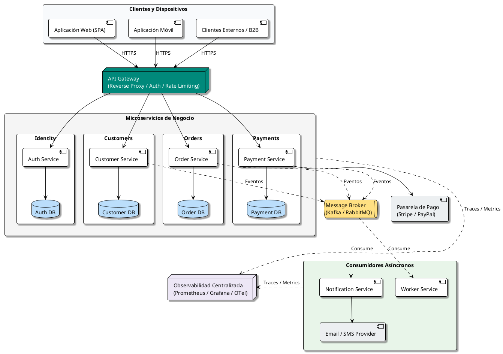
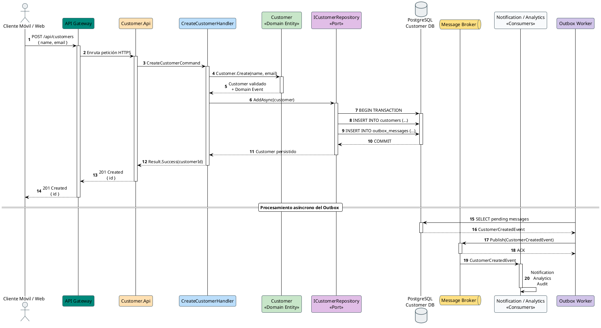
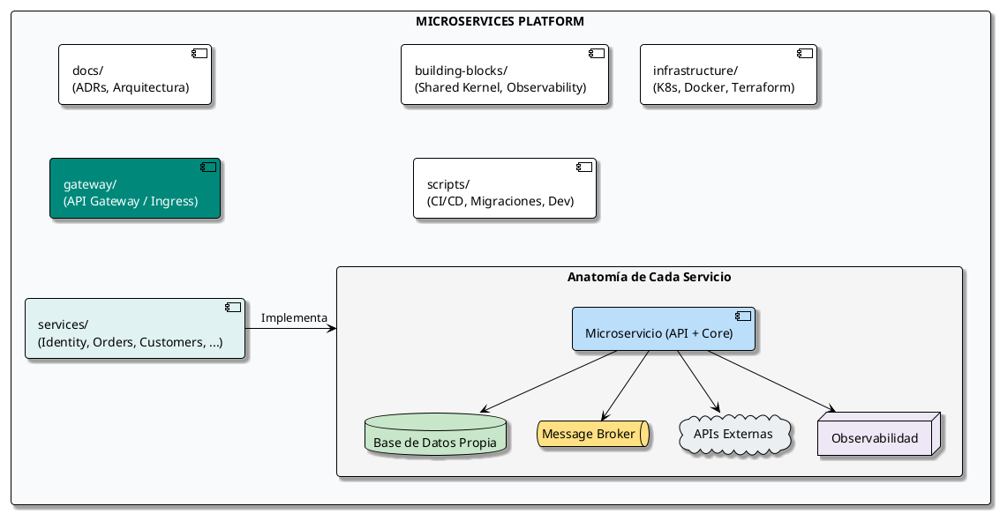
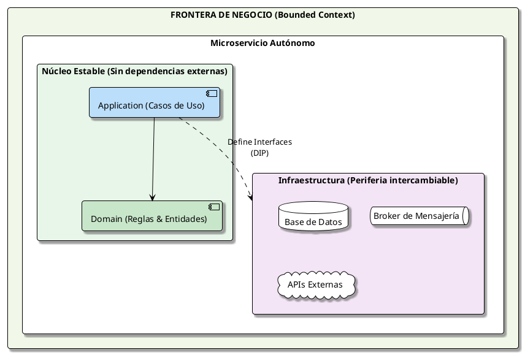

# Estructura profesional de carpetas para microservicios

## 1. Objetivo

Esta guía propone una estructura de proyecto para microservicios orientada a:

- Clean Architecture.
- Domain-Driven Design (DDD) ligero.
- Separación estricta entre dominio, aplicación e infraestructura.
- Independencia de despliegue y persistencia.
- Facilidad para pruebas unitarias e integración.
- Observabilidad, configuración y seguridad desde el inicio.
- Evolución hacia muchos microservicios sin convertir el repositorio en un monolito distribuido.

> **Idea principal:** cada microservicio debe poder entenderse, probarse, desplegarse y evolucionar de forma independiente.

---

# 2. Arquitectura general



---

# 3. Estructura recomendada del repositorio

Una opción práctica para una organización con varios microservicios es:

```text
microservices-platform/
│
├── README.md
├── docker-compose.yml
├── .gitignore
├── .editorconfig
├── .env.example
│
├── docs/
│   ├── architecture/
│   │   ├── overview.md
│   │   ├── decisions/
│   │   │   ├── ADR-001-database-per-service.md
│   │   │   ├── ADR-002-event-driven-communication.md
│   │   │   └── ADR-003-api-gateway.md
│   │   └── diagrams/
│   │       ├── architecture.md
│   │       └── sequence.md
│   │
│   ├── api/
│   │   └── conventions.md
│   │
│   └── development/
│       ├── local-setup.md
│       └── coding-standards.md
│
├── building-blocks/
│   ├── shared-kernel/
│   ├── observability/
│   └── testing/
│
├── services/
│   │
│   ├── identity/
│   │   ├── src/
│   │   ├── tests/
│   │   ├── Dockerfile
│   │   └── README.md
│   │
│   ├── customer/
│   │   ├── src/
│   │   ├── tests/
│   │   ├── Dockerfile
│   │   └── README.md
│   │
│   ├── order/
│   │   ├── src/
│   │   ├── tests/
│   │   ├── Dockerfile
│   │   └── README.md
│   │
│   ├── payment/
│   │   ├── src/
│   │   ├── tests/
│   │   ├── Dockerfile
│   │   └── README.md
│   │
│   └── notification/
│       ├── src/
│       ├── tests/
│       ├── Dockerfile
│       └── README.md
│
├── gateway/
│   └── api-gateway/
│       ├── src/
│       └── tests/
│
├── infrastructure/
│   ├── docker/
│   ├── kubernetes/
│   ├── terraform/
│   └── monitoring/
│
└── scripts/
    ├── dev/
    ├── database/
    └── deployment/
```

---

# 4. Estructura interna de un microservicio

Para cada servicio recomiendo mantener una estructura consistente.

Ejemplo: `customer-service`.

```text
customer/
│
├── src/
│   ├── Customer.Api/
│   │   ├── Controllers/
│   │   ├── Middleware/
│   │   ├── Filters/
│   │   ├── Extensions/
│   │   ├── DependencyInjection/
│   │   ├── Program.cs
│   │   └── appsettings.json
│   │
│   ├── Customer.Application/
│   │   ├── Abstractions/
│   │   │   ├── Persistence/
│   │   │   ├── Messaging/
│   │   │   └── Services/
│   │   │
│   │   ├── Customers/
│   │   │   ├── Commands/
│   │   │   │   ├── CreateCustomer/
│   │   │   │   │   ├── CreateCustomerCommand.cs
│   │   │   │   │   ├── CreateCustomerHandler.cs
│   │   │   │   │   └── CreateCustomerValidator.cs
│   │   │   │   │
│   │   │   │   └── UpdateCustomer/
│   │   │   │
│   │   │   └── Queries/
│   │   │       ├── GetCustomer/
│   │   │       └── SearchCustomers/
│   │   │
│   │   ├── DTOs/
│   │   ├── Behaviors/
│   │   └── DependencyInjection.cs
│   │
│   ├── Customer.Domain/
│   │   ├── Entities/
│   │   │   └── Customer.cs
│   │   │
│   │   ├── ValueObjects/
│   │   │   ├── CustomerId.cs
│   │   │   └── Email.cs
│   │   │
│   │   ├── Aggregates/
│   │   ├── Events/
│   │   │   └── CustomerCreatedDomainEvent.cs
│   │   ├── Exceptions/
│   │   ├── Services/
│   │   ├── Specifications/
│   │   └── Enums/
│   │
│   └── Customer.Infrastructure/
│       ├── Persistence/
│       │   ├── CustomerDbContext.cs
│       │   ├── Configurations/
│       │   ├── Repositories/
│       │   └── Migrations/
│       │
│       ├── Messaging/
│       │   ├── Consumers/
│       │   └── Publishers/
│       │
│       ├── ExternalServices/
│       │   └── IdentityClient.cs
│       │
│       ├── Caching/
│       ├── Observability/
│       └── DependencyInjection.cs
│
├── tests/
│   ├── Customer.UnitTests/
│   ├── Customer.IntegrationTests/
│   └── Customer.ArchitectureTests/
│
├── Dockerfile
├── Customer.sln
└── README.md
```

---

# 5. Regla de dependencias

La dirección de dependencia debería ser:

```plantuml
@startuml
!theme plain

skinparam backgroundColor #FAFAFA
skinparam shadowing false
skinparam roundCorner 12
skinparam packageStyle rectangle
skinparam defaultFontName "Segoe UI"
skinparam defaultFontSize 14

skinparam package {
    BorderColor #455A64
    FontColor #263238
    FontStyle bold
}

skinparam component {
    BorderColor #546E7A
    BackgroundColor #FFFFFF
    FontColor #263238
}

skinparam interface {
    BorderColor #455A64
    BackgroundColor #FFFFFF
    FontColor #263238
}

skinparam database {
    BorderColor #546E7A
    BackgroundColor #FFFFFF
}

skinparam ArrowColor #455A64
skinparam ArrowThickness 1.5

' ============================================================
' DOMAIN
' ============================================================

package "Customer.Domain\nNúcleo de Negocio" as DOMAIN #C8E6C9 {

    component "Customer\n<<Entity>>" as Customer

    component "CustomerId\nEmail\nPhone\n<<Value Objects>>" as ValueObjects

    component "Business Rules\nInvariants\nDomain Logic" as Rules

    Customer --> ValueObjects : utiliza
    Customer --> Rules : aplica
}

' ============================================================
' APPLICATION
' ============================================================

package "Customer.Application\nCasos de Uso" as APPLICATION #BBDEFB {

    package "Use Cases" {

        component "CreateCustomer\n<<Command>>" as CreateCustomer

        component "GetCustomer\n<<Query>>" as GetCustomer

        component "UpdateCustomer\n<<Command>>" as UpdateCustomer
    }

    package "Ports / Abstractions" {

        interface "ICustomerRepository" as CustomerRepository

        interface "IUnitOfWork" as UnitOfWork
    }

    CreateCustomer --> CustomerRepository
    GetCustomer --> CustomerRepository
    UpdateCustomer --> CustomerRepository

    CreateCustomer --> UnitOfWork
    UpdateCustomer --> UnitOfWork
}

' ============================================================
' INFRASTRUCTURE
' ============================================================

package "Customer.Infrastructure\nImplementaciones Técnicas" as INFRA #E1BEE7 {

    package "Persistence" {

        component "CustomerRepository\n<<EF Core>>" as EFRepository

        component "CustomerDbContext\n<<DbContext>>" as DbContext

        database "SQL Server\nCustomerDB" as DB
    }

    package "External Services" {

        component "Email Service" as EmailService

        component "External APIs" as ExternalAPI
    }

    EFRepository --> DbContext
    DbContext --> DB

    EmailService --> ExternalAPI
}

' ============================================================
' API
' ============================================================

package "Customer.Api\nPresentación / REST" as API #FFE0B2 {

    component "Controllers\n/ Minimal APIs" as Controllers

    component "Dependency Injection\nMiddleware\nException Handling" as CrossCutting

    Controllers --> CrossCutting
}

' ============================================================
' DEPENDENCIAS
' ============================================================

API --> APPLICATION : Ejecuta casos de uso

APPLICATION --> DOMAIN : Utiliza modelo de negocio

INFRA ..|> CustomerRepository : Implementa

INFRA ..|> UnitOfWork : Implementa

INFRA --> DOMAIN : Persiste /\nreconstruye entidades

' ============================================================
' NOTA DEL DOMAIN
' ============================================================

note right of DOMAIN
    <b>DOMAIN = CORAZÓN DEL SISTEMA</b>

    Contiene:

    • Entidades
    • Value Objects
    • Reglas de negocio
    • Invariantes
    • Domain Services

    No depende de:

    • API
    • EF Core
    • SQL Server
    • HTTP
    • Frameworks externos
end note

' ============================================================
' NOTA DE APPLICATION
' ============================================================

note right of APPLICATION
    <b>APPLICATION = ORQUESTADOR</b>

    Contiene:

    • Commands
    • Queries
    • Handlers
    • DTOs
    • Interfaces / Ports

    Define QUÉ necesita,
    pero no CÓMO se implementa.
end note

' ============================================================
' NOTA DE INFRASTRUCTURE
' ============================================================

note left of INFRA
    <b>INFRASTRUCTURE = TECNOLOGÍA</b>

    Contiene:

    • EF Core
    • SQL Server
    • Repositories
    • APIs externas
    • Email
    • Files
    • Message Brokers

    Implementa los Ports
    definidos por Application.
end note

' ============================================================
' NOTA DE API
' ============================================================

note right of API
    <b>API = PUNTO DE ENTRADA</b>

    Recibe:

    HTTP Request

    Devuelve:

    HTTP Response

    No contiene reglas
    de negocio.
end note

' ============================================================
' REGLA DE DEPENDENCIAS
' ============================================================

note bottom of DOMAIN
    <b>REGLA FUNDAMENTAL DE CLEAN ARCHITECTURE</b>

    Las dependencias apuntan hacia el núcleo.

    API ────────────► Application ────────────► Domain

    Infrastructure ─► Application
    Infrastructure ─► Domain

    Domain NO conoce las capas externas.
end note

@enduml
```



Conceptualmente:

> **El Domain es el núcleo estable:** Nunca debe tener dependencias hacia Infrastructure ni frameworks externos. La Infrastructure depende hacia adentro implementando las abstracciones definidas en Application.

El **Domain no debe conocer Infrastructure**.

Por ejemplo:

```csharp
public interface ICustomerRepository
{
    Task<Customer?> GetByIdAsync(
        CustomerId id,
        CancellationToken cancellationToken);
}
```

La interfaz puede vivir en `Application`, mientras que la implementación puede vivir en `Infrastructure`:

```csharp
public sealed class CustomerRepository
    : ICustomerRepository
{
    private readonly CustomerDbContext _context;

    public CustomerRepository(CustomerDbContext context)
    {
        _context = context;
    }
}
```

---

# 6. ¿Qué debe vivir en cada capa?

## Domain

Contiene las reglas de negocio que deberían existir independientemente de HTTP, SQL Server, Kafka, Redis o cualquier framework.

```text
Domain/
├── Entities/
├── ValueObjects/
├── Aggregates/
├── DomainEvents/
├── Specifications/
├── Exceptions/
└── Services/
```

Ejemplo:

```csharp
public class Customer
{
    public CustomerId Id { get; private set; }
    public string Name { get; private set; }

    public void ChangeName(string name)
    {
        if (string.IsNullOrWhiteSpace(name))
            throw new DomainException("Customer name is required.");

        Name = name;
    }
}
```

---

# 7. Application

Application representa los casos de uso.

Ejemplo:

```text
Application/
└── Customers/
    ├── Commands/
    │   └── CreateCustomer/
    │       ├── CreateCustomerCommand.cs
    │       ├── CreateCustomerHandler.cs
    │       └── CreateCustomerValidator.cs
    │
    └── Queries/
        └── GetCustomer/
            ├── GetCustomerQuery.cs
            ├── GetCustomerHandler.cs
            └── GetCustomerResponse.cs
```

Un caso de uso típico:

```text
HTTP Request
     │
     ▼
Controller
     │
     ▼
CreateCustomerCommand
     │
     ▼
CreateCustomerHandler
     │
     ├──► Domain
     │
     ├──► Repository
     │
     └──► Event
```

---

# 8. Infrastructure

Aquí viven los detalles técnicos.

```text
Infrastructure/
├── Persistence/
│   ├── DbContext
│   ├── EntityConfigurations
│   ├── Repositories
│   └── Migrations
│
├── Messaging/
│   ├── Kafka
│   ├── RabbitMQ
│   └── Consumers
│
├── ExternalServices/
│   ├── PaymentProvider
│   └── IdentityProvider
│
├── Caching/
│   └── Redis
│
└── Observability/
    ├── Logging
    ├── Metrics
    └── Tracing
```

Infrastructure implementa interfaces definidas por capas internas.

---

# 9. API

La API debe ser delgada.

```text
Controller
   │
   │ recibe HTTP
   ▼
Command / Query
   │
   ▼
Handler
   │
   ▼
Domain + Application
```

Evitar:

```csharp
[HttpPost]
public async Task<IActionResult> Create(CustomerDto dto)
{
    // Validación compleja
    // Reglas de negocio
    // SQL
    // Publicación Kafka
    // Envío email
    // Transformaciones
}
```

Preferir:

```csharp
[HttpPost]
public async Task<IActionResult> Create(
    CreateCustomerRequest request,
    CancellationToken cancellationToken)
{
    var command = request.ToCommand();

    var result = await _sender.Send(
        command,
        cancellationToken);

    return CreatedAtAction(
        nameof(GetById),
        new { id = result.Id },
        result);
}
```

---

# 10. Comunicación entre microservicios

## Comunicación síncrona

Úsala cuando el consumidor necesita una respuesta inmediata.

```text
Order Service
     │
     │ HTTP / gRPC
     ▼
Customer Service
     │
     ▼
Customer DB
```

Ejemplo:

```text
POST /orders
      │
      ▼
Order Service
      │
      │ GET Customer
      ▼
Customer Service
      │
      ▼
Response
```

## Comunicación asíncrona

Úsala para eventos y procesos desacoplados.

```text
Customer Service
       │
       │ CustomerCreated
       ▼
 Message Broker
       │
       ├──────────────► Notification Service
       │
       └──────────────► Analytics Service
```

Esto evita que Customer Service tenga que conocer directamente todos sus consumidores.

---

# 11. Base de datos por microservicio

Una regla importante:

```text
Customer Service ─────► Customer DB

Order Service ─────────► Order DB

Payment Service ───────► Payment DB
```

Evitar:

```text
Customer Service ──┐
Order Service ─────┼──► Shared Database
Payment Service ───┘
```

Cada servicio debe ser dueño de sus datos.

Esto permite:

- Evolucionar esquemas independientemente.
- Escalar bases de datos según necesidad.
- Evitar acoplamiento directo.
- Cambiar tecnología de persistencia cuando sea necesario.

---

# 12. Shared Kernel: usarlo con cuidado

No convertir `shared` en un cajón de todo.

Malo:

```text
shared/
├── Customer.cs
├── Order.cs
├── Payment.cs
├── CustomerRepository.cs
├── OrderRepository.cs
└── Everything.cs
```

Mejor:

```text
building-blocks/
├── shared-kernel/
│   ├── Domain/
│   ├── Result/
│   ├── Exceptions/
│   └── Contracts/
│
├── observability/
└── testing/
```

Compartir infraestructura técnica es diferente de compartir reglas de negocio.

---

# 13. Tests

Cada microservicio debería tener como mínimo:

```text
tests/
├── Customer.UnitTests/
├── Customer.IntegrationTests/
└── Customer.ArchitectureTests/
```

### UnitTests

Prueban reglas aisladas.

```text
Customer
 └── ChangeName()
      ├── nombre válido
      ├── nombre vacío
      └── nombre nulo
```

### IntegrationTests

Prueban componentes reales juntos.

```text
API
 │
 ▼
Application
 │
 ▼
Infrastructure
 │
 ▼
Test Database
```

### ArchitectureTests

Verifican que las dependencias arquitectónicas no se rompan.

Ejemplo conceptual:

```text
Domain
  X──► Infrastructure

Application
  X──► Api
```

---

# 14. README de cada microservicio

Cada servicio debe tener su propio README.

Ejemplo:

```text
customer/
└── README.md
```

Contenido recomendado:

```markdown
# Customer Service

## Purpose

Responsible for customer lifecycle management.

## Technology

- .NET
- ASP.NET Core
- Entity Framework Core
- PostgreSQL
- Redis
- RabbitMQ

## Endpoints

POST   /api/customers
GET    /api/customers/{id}
GET    /api/customers

## Events

Publishes:

- CustomerCreated
- CustomerUpdated

Consumes:

- CustomerBlocked

## Local execution

dotnet run

## Tests

dotnet test
```

---

# 15. Naming conventions

Mantener nombres previsibles.

```text
customer-service
order-service
payment-service
notification-service
identity-service
```

Dentro del código:

```text
CreateCustomerCommand
CreateCustomerHandler
CreateCustomerValidator

GetCustomerQuery
GetCustomerHandler
GetCustomerResponse
```

Evitar nombres ambiguos:

```text
CustomerManager
Helper
Utils
CommonService
GeneralService
Misc
```

---

# 16. Configuración

No almacenar secretos en Git.

```text
appsettings.json
appsettings.Development.json
appsettings.Production.json
```

Secretos:

```text
Environment Variables
        +
Secret Manager
        +
Cloud Secret Store
```

Ejemplo:

```json
{
  "ConnectionStrings": {
    "CustomerDatabase": ""
  },
  "Messaging": {
    "Broker": ""
  }
}
```

El valor real debe inyectarse en el entorno.

---

# 17. Observabilidad

Cada microservicio debería generar:

```text
Logs
Metrics
Traces
Health Checks
```

Ejemplo:

```text
Customer Service
      │
      ├──► Logs
      ├──► Metrics
      ├──► Distributed Tracing
      └──► /health
```

Un request debería poder seguirse:

```text
Gateway
   │ traceId=abc123
   ▼
Order Service
   │ traceId=abc123
   ▼
Payment Service
   │ traceId=abc123
   ▼
Payment Provider
```

---

# 18. Docker

Cada microservicio debería tener su propio `Dockerfile`.

```text
services/
└── customer/
    ├── src/
    ├── tests/
    └── Dockerfile
```

Ejemplo conceptual:

```text
Docker Image
     │
     ▼
customer-service:1.0.0
```

El versionamiento de imágenes permite desplegar una versión concreta sin afectar otros servicios.

---

# 19. Kubernetes

Cuando la plataforma crece, la infraestructura puede organizarse así:

```text
infrastructure/
└── kubernetes/
    ├── namespaces/
    ├── configmaps/
    ├── secrets/
    ├── ingress/
    │
    └── services/
        ├── customer/
        │   ├── deployment.yaml
        │   ├── service.yaml
        │   ├── configmap.yaml
        │   └── hpa.yaml
        │
        ├── order/
        └── payment/
```

---

# 20. CI/CD

Una estructura posible:

```text
.github/
└── workflows/
    ├── customer-ci.yml
    ├── order-ci.yml
    ├── payment-ci.yml
    └── deploy.yml
```

Pipeline:

```text
Commit
  │
  ▼
Build
  │
  ▼
Unit Tests
  │
  ▼
Integration Tests
  │
  ▼
Architecture Tests
  │
  ▼
Docker Build
  │
  ▼
Security Scan
  │
  ▼
Registry
  │
  ▼
Deployment
```

---

# 21. Ejemplo completo: Customer Service

```text
customer/
│
├── src/
│   │
│   ├── Customer.Api/
│   │   ├── Controllers/
│   │   │   └── CustomersController.cs
│   │   ├── Middleware/
│   │   ├── Extensions/
│   │   ├── Program.cs
│   │   └── appsettings.json
│   │
│   ├── Customer.Application/
│   │   ├── Customers/
│   │   │   ├── Commands/
│   │   │   │   └── CreateCustomer/
│   │   │   │       ├── CreateCustomerCommand.cs
│   │   │   │       ├── CreateCustomerHandler.cs
│   │   │   │       └── CreateCustomerValidator.cs
│   │   │   │
│   │   │   └── Queries/
│   │   │       └── GetCustomer/
│   │   │           ├── GetCustomerQuery.cs
│   │   │           ├── GetCustomerHandler.cs
│   │   │           └── GetCustomerResponse.cs
│   │   │
│   │   ├── Abstractions/
│   │   │   └── Persistence/
│   │   │       └── ICustomerRepository.cs
│   │   └── DependencyInjection.cs
│   │
│   ├── Customer.Domain/
│   │   ├── Entities/
│   │   │   └── Customer.cs
│   │   ├── ValueObjects/
│   │   │   └── Email.cs
│   │   ├── Events/
│   │   │   └── CustomerCreatedDomainEvent.cs
│   │   └── Exceptions/
│   │
│   └── Customer.Infrastructure/
│       ├── Persistence/
│       │   ├── CustomerDbContext.cs
│       │   ├── Configurations/
│       │   ├── Repositories/
│       │   └── Migrations/
│       ├── Messaging/
│       ├── Caching/
│       └── DependencyInjection.cs
│
├── tests/
│   ├── Customer.UnitTests/
│   ├── Customer.IntegrationTests/
│   └── Customer.ArchitectureTests/
│
├── Dockerfile
├── Customer.sln
└── README.md
```

---

# 22. Flujo de una petición real

Supongamos:

```http
POST /api/customers
```

El flujo sería:



---

# 23. Reglas de oro

## Regla 1

**Un microservicio representa una capacidad de negocio, no una tabla.**

Correcto:

```text
Customer Service
```

No:

```text
CustomerTable Service
```

## Regla 2

**El dominio no depende de infraestructura.**

```text
Domain
  ▲
  │
Application
  ▲
  │
Infrastructure
```

## Regla 3

**Cada servicio es dueño de sus datos.**

```text
Customer → Customer DB
Order    → Order DB
Payment  → Payment DB
```

## Regla 4

**No compartir entidades de dominio entre microservicios.**

Compartir contratos/eventos puede ser válido:

```text
CustomerCreatedEvent
```

pero no:

```text
CustomerEntity
```

como dependencia directa de otro servicio.

## Regla 5

**Los Controllers deben ser delgados.**

La lógica de negocio pertenece al dominio y los casos de uso a Application.

## Regla 6

**No crear abstracciones por deporte.**

Una interfaz debe representar una frontera o una necesidad real.

## Regla 7

**No crear un microservicio demasiado pronto.**

Un sistema distribuido introduce:

- Latencia.
- Fallos de red.
- Observabilidad más compleja.
- Consistencia eventual.
- Despliegues múltiples.
- Mayor coste operativo.

La separación debe responder a límites de negocio y necesidades reales.

---

# 24. Plantilla recomendada

Para crear un nuevo microservicio:

```text
services/
└── <service-name>/
    │
    ├── src/
    │   ├── <Service>.Api/
    │   ├── <Service>.Application/
    │   ├── <Service>.Domain/
    │   └── <Service>.Infrastructure/
    │
    ├── tests/
    │   ├── <Service>.UnitTests/
    │   ├── <Service>.IntegrationTests/
    │   └── <Service>.ArchitectureTests/
    │
    ├── Dockerfile
    ├── <Service>.sln
    └── README.md
```

---

# 25. Resumen visual



## Principio final

La estructura de carpetas no hace que un sistema sea un buen sistema de microservicios. La arquitectura debe proteger principalmente estos límites:



**Si los límites son buenos, la estructura de carpetas simplemente los hace visibles.**
