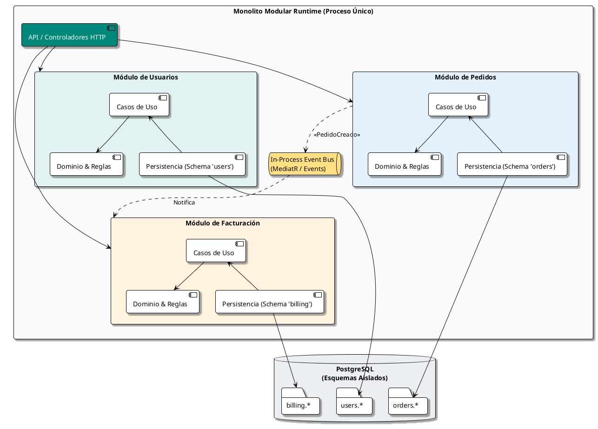

# Arquitectura de Monolito Modular (Modular Monolith)

## 1. Introducción y Filosofía

El **Monolito Modular** es un estilo arquitectónico en el que toda la aplicación se despliega como un único artefacto ejecutable (un único proceso en ejecución), pero su código fuente interno está estrictamente estructurado en **módulos independientes y desacoplados**, delimitados por los conceptos de negocio (*Bounded Contexts* de Domain-Driven Design).

> **Principio Clave:** *"Deploy together, develop with boundaries"*. Ofrece la simplicidad operacional y de despliegue de un monolito, con la higiene estructural, mantenibilidad y disciplina de límites de los microservicios.



---

## 2. ¿Por qué elegir un Monolito Modular antes que Microservicios?

Muchos equipos caen en la trampa de adoptar microservicios de manera prematura, pagando los altos costos de la computación distribuida (latencia de red, consistencia eventual, serialización, DevOps complejo, orquestación de Kubernetes) antes de conocer con certeza los límites del dominio de negocio.

| Criterio | Monolito Tradicional ("Espagueti") | Monolito Modular | Microservicios |
| :--- | :--- | :--- | :--- |
| **Límites de Dominio** | Inexistentes o difusos | Estrictos por módulo | Físicos por servicio de red |
| **Despliegue** | Simple (un artefacto) | Simple (un artefacto) | Complejo (múltiples pipelines y contenedores) |
| **Latencia Inter-módulo** | Nanosegundos (llamada en memoria) | Nanosegundos (en memoria) | Milisegundos (red HTTP/gRPC/Broker) |
| **Transacciones** | ACID sin esfuerzo | ACID o Eventual controlada | Consistencia Eventual / Sagas distribuidas |
| **Coste Operacional** | Bajo | Muy Bajo | Alto (infraestructura distribuida, observabilidad) |
| **Refactorización de Límites** | Fácil pero desordenada | **Muy sencilla** (refactor de código) | Extremadamente costosa (cambios de API y repos) |

---

## 3. Estructura de Directorios Recomendada

Una estructura empresarial para un monolito modular implementado en C#, TypeScript, Java o Go organiza cada módulo como una unidad autónoma con su propia capa de dominio, aplicación e infraestructura.

```text
modular-monolith/
│
├── .editorconfig
├── docker-compose.yml
├── README.md
│
├── src/
│   ├── Host/                          # Único punto de entrada ejecutable
│   │   ├── Program.cs / index.ts      # Configuración del servidor y DI global
│   │   ├── appsettings.json
│   │   └── Extensions/
│   │
│   ├── BuildingBlocks/                # Shared Kernel técnico reutilizable
│   │   ├── Domain/                    # Clases base: Entity, AggregateRoot, ValueObject
│   │   ├── Application/               # Interfaces: ICommand, IQuery, IEventBus
│   │   └── Infrastructure/            # Persistencia base, Interceptores, Middleware
│   │
│   └── Modules/                       # Cada carpeta representa un Bounded Context
│       │
│       ├── Users/                     # Módulo de Usuarios
│       │   ├── Users.Public/          # Contratos públicos expuestos a otros módulos (DTOs, Interfaces)
│       │   │   └── IUsersModuleApi.cs
│       │   ├── Users.Domain/          # Entidades, Value Objects, Reglas de negocio
│       │   │   ├── Model/
│       │   │   └── Events/
│       │   ├── Users.Application/     # Casos de uso (Commands/Queries)
│       │   │   ├── CreateUser/
│       │   │   └── GetUserById/
│       │   ├── Users.Infrastructure/  # DbContext propio, Repositorios, Migraciones
│       │   │   └── Persistence/
│       │   └── Users.Endpoints/       # Controladores HTTP o Minimal APIs del módulo
│       │
│       ├── Orders/                    # Módulo de Pedidos
│       │   ├── Orders.Public/
│       │   ├── Orders.Domain/
│       │   ├── Orders.Application/
│       │   ├── Orders.Infrastructure/
│       │   └── Orders.Endpoints/
│       │
│       └── Billing/                   # Módulo de Facturación
│           ├── Billing.Public/
│           ├── Billing.Domain/
│           ├── Billing.Application/
│           ├── Billing.Infrastructure/
│           └── Billing.Endpoints/
│
└── tests/
    ├── ArchitectureTests/             # Validación automática de límites (ArchUnit/NetArchTest)
    ├── Modules.Users.Tests/
    ├── Modules.Orders.Tests/
    └── IntegrationTests/
```

---

## 4. Reglas de Encapsulamiento y Fronteras

Para que un monolito modular no degenere con el tiempo en un monolito espagueti, se deben respetar **4 reglas de hierro**:

1. **Aislamiento de Clases Internas:**
   - Todo dentro de `Users.Domain`, `Users.Application` y `Users.Infrastructure` debe tener modificador de acceso interno (`internal` en C#, package-private en Java, o protegido por exports en TS/Go).
   - El módulo `Orders` **NUNCA** debe instanciar ni importar directamente una entidad de `Users` (por ejemplo, `Users.Domain.User`).
2. **Contratos Públicos (`*.Public`):**
   - La única parte accesible desde otros módulos es la carpeta `*.Public`, la cual solo contiene interfaces de consulta ligera, DTOs inmutables o definiciones de Eventos de Integración.
3. **Comunicación Asíncrona Preferente:**
   - Cuando ocurre una acción en un módulo que afecta a otro, se publica un **Evento de Dominio/Integración** a través de un bus en memoria (In-Memory Event Bus).
4. **Sin Llaves Foráneas Cruzadas en Base de Datos:**
   - La tabla `Orders.Order` **no** debe tener una Foreign Key de base de datos apuntando directamente a `Users.User`. Se almacena simplemente el `UserId` como un `Guid`/`UUID`. Esto garantiza que, si se decide extraer `Users` a un microservicio en el futuro, no se rompa ninguna integridad referencial de base de datos.

---

## 5. Estrategia de Base de Datos y Persistencia

Aunque toda la aplicación se conecte a un único motor de base de datos (por ejemplo, PostgreSQL o SQL Server), los datos deben particionarse lógicamente:

```text
Database: "eCommercePlatform"
│
├── Schema: "users"
│   ├── users.Accounts
│   ├── users.Profiles
│   └── users.Permissions
│
├── Schema: "orders"
│   ├── orders.Orders
│   ├── orders.OrderItems
│   └── orders.Shipments
│
└── Schema: "billing"
    ├── billing.Invoices
    ├── billing.Payments
    └── billing.Transactions
```

### Ventajas de los Esquemas Lógicos:
- **Migrations Independientes:** Cada módulo aplica sus propias migraciones (por ejemplo, `dotnet ef database update --context UsersDbContext`).
- **Permisos Separados:** En entornos de alta seguridad, se pueden asignar usuarios de base de datos con permisos exclusivos para cada esquema.
- **Transición Cero Dolor:** Para extraer un módulo a una base de datos física independiente, solo se requiere un dump/restore del esquema correspondiente.

---

## 6. Comunicación Inter-módulos en Memoria

### Opción A: Eventos en Proceso (Recomendada para mutaciones)

Cuando el módulo de Pedidos confirma una compra, no llama directamente a la base de datos de Facturación:

```csharp
// Dentro de Orders.Application.ConfirmOrderHandler
public async Task Handle(ConfirmOrderCommand command, CancellationToken ct)
{
    var order = await _orderRepository.GetByIdAsync(command.OrderId);
    order.Confirm();
    await _orderRepository.SaveChangesAsync(ct);

    // Publicación asíncrona dentro del mismo proceso
    await _eventBus.PublishAsync(new OrderConfirmedIntegrationEvent(
        order.Id,
        order.CustomerId,
        order.TotalAmount
    ), ct);
}
```

El módulo de Facturación escucha el evento sin conocer la lógica interna de Pedidos:

```csharp
// Dentro de Billing.Application.OrderConfirmedConsumer
public class OrderConfirmedConsumer : IIntegrationEventHandler<OrderConfirmedIntegrationEvent>
{
    private readonly IInvoiceService _invoiceService;

    public async Task Handle(OrderConfirmedIntegrationEvent @event, CancellationToken ct)
    {
        await _invoiceService.GenerateInvoiceForOrderAsync(@event.OrderId, @event.TotalAmount);
    }
}
```

---

## 7. Pruebas de Arquitectura (Fitness Functions)

Una de las mayores fortalezas del monolito modular moderno es la capacidad de escribir pruebas automáticas que fallen en el pipeline de CI si un desarrollador introduce un acoplamiento indebido:

```csharp
[Fact]
public void OrdersModule_ShouldNotReference_UsersInternalClasses()
{
    var result = Types.InAssembly(typeof(OrdersModule).Assembly)
        .ShouldNot()
        .HaveDependencyOn("Modules.Users.Domain")
        .And()
        .ShouldNot()
        .HaveDependencyOn("Modules.Users.Infrastructure")
        .GetResult();

    Assert.True(result.IsSuccessful, "Violación arquitectónica: Orders no debe acceder al dominio o infra de Users.");
}
```

---

## 8. Estrategia de Migración: De Monolito Modular a Microservicios (Strangler Fig)

Si el tráfico, la necesidad de auto-escalado independiente o el tamaño del equipo de desarrollo exigen que un módulo se convierta en un microservicio real:

1. **Paso 1:** Reemplazar el `In-Process Event Bus` del módulo por un cliente de mensajería externo (RabbitMQ, Kafka o AWS SQS).
2. **Paso 2:** Mover la carpeta del módulo (`src/Modules/Users/`) a un nuevo repositorio independiente.
3. **Paso 3:** Exportar el esquema de base de datos (`users`) a su propia base de datos dedicada.
4. **Paso 4:** Colocar un API Gateway delante para enrutar el tráfico de `/api/users/*` hacia el nuevo microservicio y el resto hacia el monolito modular.

> **Conclusión:** El Monolito Modular es el estándar dorado para la gran mayoría de startups y empresas medianas: maximiza la velocidad de desarrollo en fases tempranas y deja la puerta 100% abierta a una descomposición ordenada en microservicios sin reescribir la lógica de negocio.
